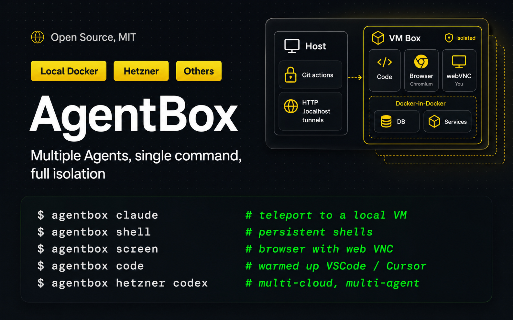

<h1 style="font-weight:normal">
  AgentBox&nbsp;
  <a href="./LICENSE"></a>
  <a href="https://www.npmjs.com/package/@madarco/agentbox"></a>
  
</h1>

Run multiple agents in parallel, with a single command, on your PC, self-hosted, or in the cloud

Works with [iterm2](https://agent-box.sh/docs/integrations-iterm2) - [cmux](https://agent-box.sh/docs/integrations-cmux) - [tmux](https://agent-box.sh/docs/integrations-tmux) - [Herdr](https://agent-box.sh/docs/integrations-herdr)
<br>

<p align="center">


</p>

## How it works

```sh
agentbox claude # launch a new VM with claude and your project inside
```

- 📦 **Teleport** - Move your project to a dedicated VM, local or in the cloud, with a single command.
- 🤖 **Automatic** - Bring all your skills, plugins, and settings for **Claude Code**, **Codex**, **Open Code**
- 🌐 **A full Computer** — Dedicated browser, screen sharing, persistent shells and warmed up VS Code / Cursor IDE, with each box.
- 💾 **Checkpoints** — Sub <1s startup of new boxes from a previous checkpoint, auto pause to save cost/resources when not in use.
- 🔒 **Safe** - Your git credentials are kept on your local machine, with permission requests to push to the remote repository.

Full [Documentation](https://agent-box.sh/docs)

### Complete setup:

```sh
npm -g install @madarco/agentbox
agentbox install

# Launch a new VM with claude, copy all your settings and workspace
agentbox claude

# Also install required project libraries and launch your dev server
> Run setup wizard? -> Yes

# Also use a cloud:
agentbox hetzner claude # or vercel, daytona

# Ctrl+a d to detach, claude keep going, to reconnect later:
agentbox attach 1

# To open a persistent shell inside the box:
agentbox shell 1

# Create a second box:
agentbox claude
agentbox attach 2
agentbox shell 2

# Open your web project on a .local url tunnel on your pc
agentbox url 2
# Or the in-box browser via webVNC:
agentbox screen 2
# Or connect to vscode/cursor inside the box:
agentbox code 2

# See status and quickly switch between agents:
agentbox dashboard
```

## Demo


## Install

```sh
npm -g install @madarco/agentbox
```

Requirements: macOS (arm64 or Intel) or Linux, Docker ([Docker Desktop](https://www.docker.com/products/docker-desktop/) or [OrbStack](https://orbstack.dev/)), Node `>=20.10`. The first `agentbox create` / `agentbox claude` builds the `agentbox/box:dev` image (~1 GB, one-time).
Uses `portless` to give box web apps the same URL from inside the box and on the host.

## Cloud Providers

|                     | local docker              | hetzner                | daytona            | vercel             | e2b                |
| ------------------- | ------------------------- | ---------------------- | ------------------ | ------------------ | ------------------ |
| Support             | ✅                        | ✅                     | ⚠️ Partial         | ✅                 | ✅                 |
| Base image          | Dockerfile                | Setup script (Ubuntu)  | Dockerfile         | Setup script       | Dockerfile (`Template.build`) |
| Live snapshots      | ✅                        | ✅                     | 🧪 Experimental    | ✅                 | ✅                 |
| Private preview URLs| ✅ (portless or OrbStack) | ✅ (portless)          | ✅ (native)        | ✅ (native)        | ✅ (native)        |

**Cloud setup** (optional — skip for local Docker)

- `agentbox install` — interactive setup wizard to choose which providers to use and configure them.
- `agentbox vercel login` — interactive Vercel Sandbox token setup, saved to `~/.agentbox/secrets.env`
- `agentbox hetzner login` — interactive Hetzner Cloud token setup, saved to `~/.agentbox/secrets.env`
- `agentbox daytona login` — interactive Daytona API key setup, saved to `~/.agentbox/secrets.env`
- `agentbox e2b login` — interactive E2B API key setup, saved to `~/.agentbox/secrets.env`
- `agentbox digitalocean login` — interactive DigitalOcean Personal Access Token setup, saved to `~/.agentbox/secrets.env`
- `agentbox prepare [--provider daytona|hetzner|vercel|e2b|digitalocean]` — build the image and initial snapshot (e2b builds from a Dockerfile via `Template.build()`)
- `agentbox hetzner claude`, `agentbox hetzner codex`, `agentbox hetzner create`, etc.

## How to use

`<box>` is optional almost everywhere — it defaults to the box for the current project, or use its short index (`1`, `2`, …), name, or id prefix.

**Create & run**

- `agentbox create` — Create and start a new agent box (Docker container with FUSE overlay)
- `agentbox claude` — Create a sandboxed box and launch Claude Code in a detachable tmux session

**Access**

- `agentbox url` — Open a box's web app URL in the browser (even with no `expose:` service)
- `agentbox screen` — Open a box's VNC (noVNC) viewer in the browser
- `agentbox code` — Open a box in VS Code or Cursor via the Dev Containers extension
- `agentbox shell` — Open an interactive bash shell in a box
- `agentbox open` — Open a box's merged workspace in Finder
- `agentbox logs` — Print recent log lines from a box service; `-f` to stream
- `agentbox dashboard` — Box list + the selected box's live agent session

**Inspect**

- `agentbox list` (`ls`) — List boxes in current project or `-g` for all
- `agentbox status` — Show service + task status from a box's `agentbox-ctl` daemon
- `agentbox top` — Live resource monitor (cpu/mem/pids/disk) for a box, project, or all boxes

**Lifecycle**

- `agentbox start` — Start a stopped box (docker start + re-mount the FUSE overlay)
- `agentbox stop` — Stop a box (preserves the upper volume, `node_modules` included)
- `agentbox destroy` (`rm`) — Destroy a box and discard its upper volume
- `agentbox pause` / `agentbox unpause` — Freeze / resume a box (sub-second)

**Sync & state**

- `agentbox download` — Download a box's `/workspace` back into your host workspace (gitignore-aware)
- `agentbox cp <src> [dst]` — Copy individual files between host and box (like `docker cp`; direction picked by `name:` prefix)
- `agentbox checkpoint` (alias `checkpoints`) — List and manage project checkpoints (warm box state to start new boxes from); bare command lists, `checkpoint create` captures

**Advanced**

- `agentbox wait` — Block until the box reports all autostart units ready
- `agentbox prune` — Clean up orphan state records (and with `--all`, orphan docker resources)
- `agentbox self-update` — Update agentbox, wipe the box image so it rebuilds, reload the relay
- `agentbox config` — Read / write layered config (global, per-project, workspace `defaults:`)
- `agentbox relay` — Manage the host relay process (`status` / `stop` / `start` / `restart`)
- `agentbox app` — Control the macOS menu-bar app process (`status` / `start` / `stop` / `restart`); install it with `agentbox install tray`

Run `agentbox <command> --help` for command-specific options.

## Documentation

Full documentation lives at **[agent-box.sh/docs](https://agent-box.sh/docs)**:

- [Quickstart](https://agent-box.sh/docs) and [Core concepts](https://agent-box.sh/docs/core-concepts)
- [Teleport a project](https://agent-box.sh/docs/teleport-a-project), [Run an agent](https://agent-box.sh/docs/run-an-agent), [Access your box](https://agent-box.sh/docs/access-your-box)
- [Configuration](https://agent-box.sh/docs/configuration), [Services & tasks](https://agent-box.sh/docs/services-and-tasks), [Sync & git](https://agent-box.sh/docs/sync-and-git)
- Cloud providers: [Hetzner](https://agent-box.sh/docs/hetzner), [Daytona](https://agent-box.sh/docs/daytona), [Vercel](https://agent-box.sh/docs/vercel), [E2B](https://agent-box.sh/docs/e2b), [DigitalOcean](https://agent-box.sh/docs/digitalocean)
- Full [CLI reference](https://agent-box.sh/docs/cli)

## Development

```sh
git clone https://github.com/madarco/agentbox && cd agentbox
pnpm install && pnpm build
node apps/cli/dist/index.js --help
```

The full development workflow, stack, end-to-end smoke tests, and teardown live in [`docs/development.md`](./docs/development.md).

### Menu-bar tray app (dev)

The macOS tray app lives in the sibling repo [`../agentbox-tray`](https://github.com/madarco/agentbox-tray). When you have it checked out next to this repo, these scripts build and run your **local** dev build (ad-hoc signed, at `../agentbox-tray/AgentBoxTray.app`) — separate from the notarized copy `agentbox install tray` puts in `/Applications`:

```sh
pnpm tray:dev        # rebuild the dev .app and relaunch it (the one you'll use most)
pnpm tray:build      # just rebuild (scripts/make-app.sh)
pnpm tray:start      # launch the dev build
pnpm tray:stop       # quit any running instance
pnpm tray:restart    # quit + relaunch the dev build
```

> Note: `agentbox app start|restart` targets the **installed** `/Applications` copy, not this dev build. Use the `pnpm tray:*` scripts while iterating on the tray here; run `agentbox install tray` to refresh `/Applications` from the current CLI build.

### Custom providers (plugins)

AgentBox's provider surface is open — you can run agents on your own cloud/infra by shipping a **provider plugin** (its own npm package built on [`@madarco/agentbox-provider-sdk`](https://www.npmjs.com/package/@madarco/agentbox-provider-sdk)), with no changes to AgentBox. Build and test against the bundled example provider locally:

```sh
# build the SDK, then build + register the example provider
pnpm --filter @madarco/agentbox-provider-sdk build
cd examples/agentbox-provider-example && npm install && npm run build
node ../../apps/cli/dist/index.js plugin add .      # register it
node ../../apps/cli/dist/index.js doctor            # shows the provider's group

# verify the SDK artifact in isolation (packs + installs the tarball, asserts exports)
pnpm --filter @madarco/agentbox-provider-sdk pack:test
```

Full guide: [Build a provider](https://agent-box.sh/docs/build-a-provider) (and the authoring reference [`docs/provider-plugins.md`](./docs/provider-plugins.md)). Reference packages: [`examples/agentbox-provider-sample`](./examples/agentbox-provider-sample) (stub) and [`examples/agentbox-provider-example`](./examples/agentbox-provider-example) (a real, Vercel-backed provider).

# Contributing

Bug reports, docs fixes, and provider work are welcome — see [CONTRIBUTING.md](./CONTRIBUTING.md). First-time contributors sign a one-line [CLA](./.github/CLA.md) on their first pull request. Security issues go through [SECURITY.md](./SECURITY.md), not a public issue.

# Author

[Marco D'Alia](https://www.madarco.net) - [@madarco](https://x.com/madarco) - [Linkedin](https://www.linkedin.com/in/marcodalia/)

# License

MIT. See [LICENSE](./LICENSE).

